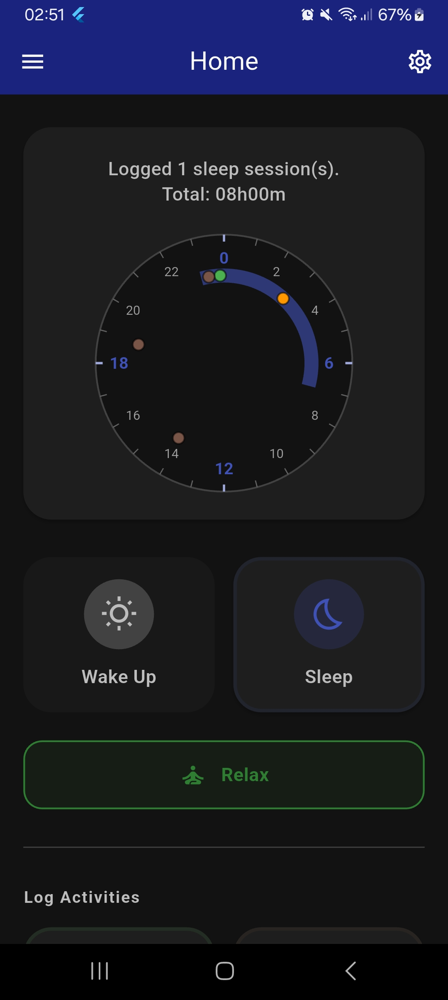
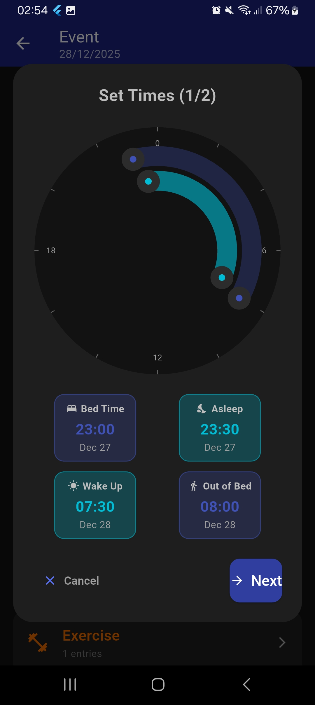
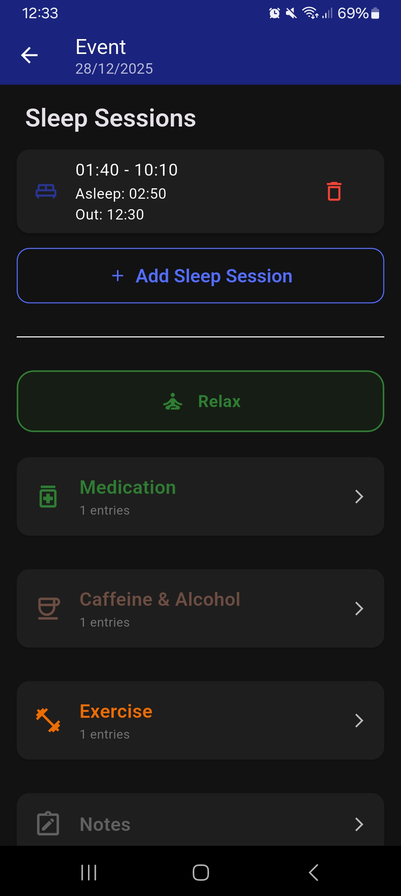
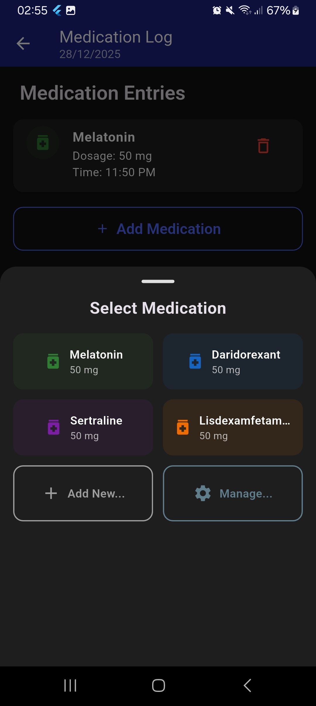
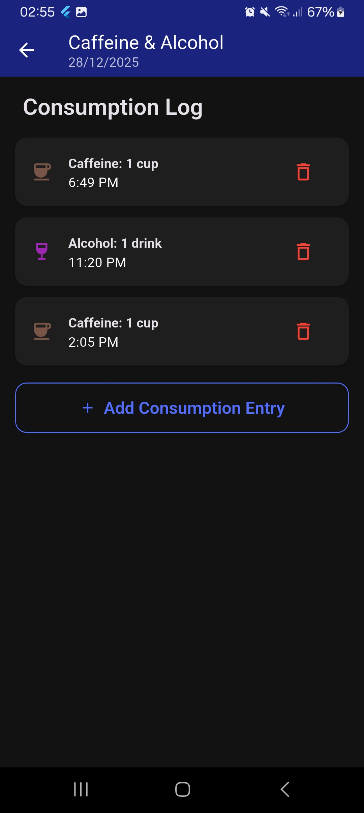
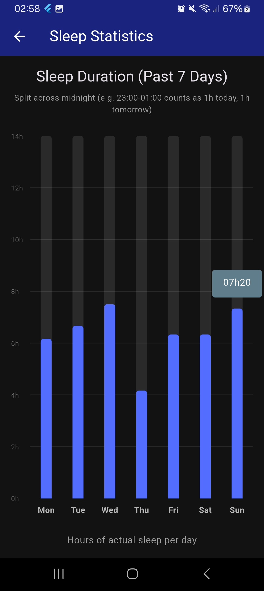
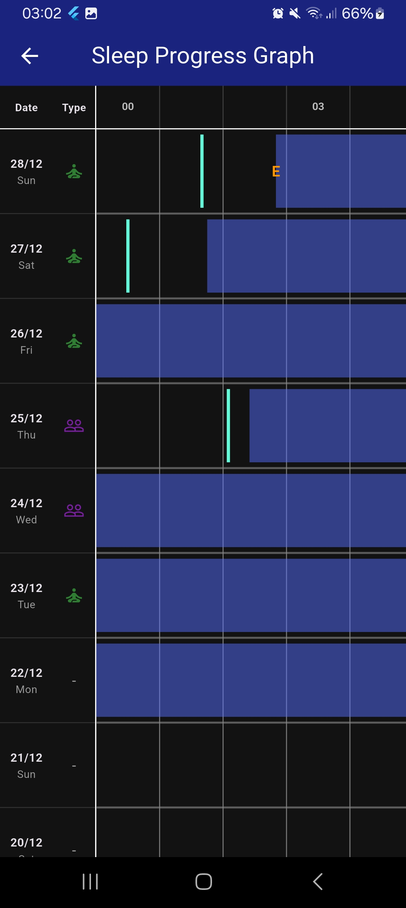
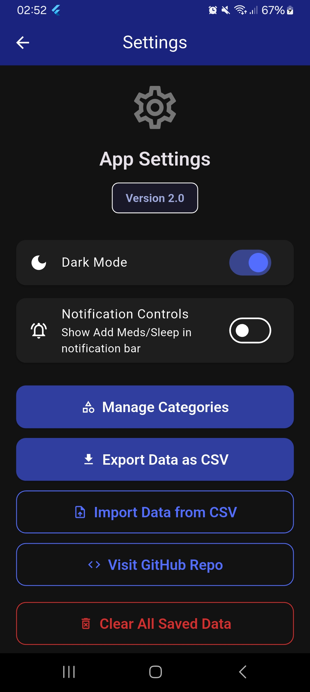
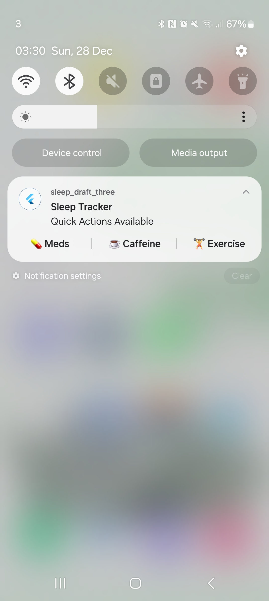

# Project Impactive Sleep Tracker App
<!-- ^ is there a more succint name for the app? if yes, please change the name here, in all the documentation files, and in the app itself -->

A Flutter-based sleep tracking app designed for monitoring sleep patterns, logging daily activities (such as caffeine intake, exercise, medication), analyzing correlations between activities and sleep quality, and exporting data for further analysis.

This project was developed as part of [Project Impactive](https://studentsunionucl.org/volunteering/organisation/project-impactive) and was co-created to meet the requirements of an individual with a circadian rhythm disorder, providing a tool to monitor sleep patterns beyond a paper sleep diary.

This project will no longer actively be worked on from 19/01/2026, but can be used, distributed, adapted, and built upon under the terms of the [GPLv3 Licence](https://www.gnu.org/licenses/gpl-3.0.en.html#license-text) ([LICENSE](LICENSE)).
<!-- ^ still need to add link to LICENSE file -->

- [Key features](#key-features)
- [Installation instructions](#installation-instructions)<!-- - [Video tutorial](#video-tutorial) -->
- [Contact](#contact)
- [Licensing](#licensing)
- [Contributors](#contributors)
- [Screenshots](#screenshots)

## Key features
1. **Sleep tracking** including bed/asleep/wake/rise times
2. Logging **daily activities** including caffeine and alcohol intake, exercise, medication, day type, and user notes
3. **Visualizations** and analysis including graphs, heatmaps, efficiency metrics, and correlation analysis
4. **Edit past entries** from the calendar view
5. **Data import** and **export** capabilities

For more details, please visit the [features documentation](documentation/features/0_overview.md).

## Installation instructions
Please follow the Android App instructions to use the sleep tracker app.

- [Installation instructions and requirements - Android App](documentation/installation/android.md)
- [Installation instructions and requirements - Source Code (for devs)](documentation/installation/source.md)
- [Deployment guide (for devs)](documentation/installation/deployment.md)

> [!NOTE]  
> This app was designed and tested for Android. iOS and other platforms may have limited functionality.

## Contact
For queries, please contact [su.impactive@ucl.ac.uk](mailto:su.impactive@ucl.ac.uk)

## Licensing
The creation of Project Impactive Sleep Tracker App was supported by the UCL Students' Union Social Impact team under the Student-Led Project [Project Impactive](https://studentsunionucl.org/volunteering/organisation/project-impactive). It is released under the [GNU General Public License (GPLv3)](https://www.gnu.org/licenses/gpl-3.0.en.html), meaning you can use, modify, and distribute the software freely, provided that any derivative works are also licensed under the GPL.
<!-- add the link to the GPL website somewhere in this section + add the LICENSE file to the repo through github account when making it public https://stackoverflow.com/questions/31639059/how-to-add-license-to-an-existing-github-project -->

## Contributors
Christos Toilos ([@papaang](https://www.github.com/papaang)),
Sherin Vinod Danny,
Elizaveta Kiseleva,
Aaron Sohal,
and
Rozenn Raffaut ([@rozenn1](https://www.github.com/rozenn1)).

With thanks to Elliot Samuel Shayle for project ideation, and for testing and feedback throughout app development.

## Screenshots

