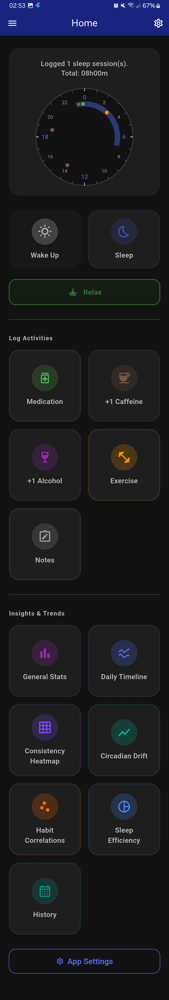
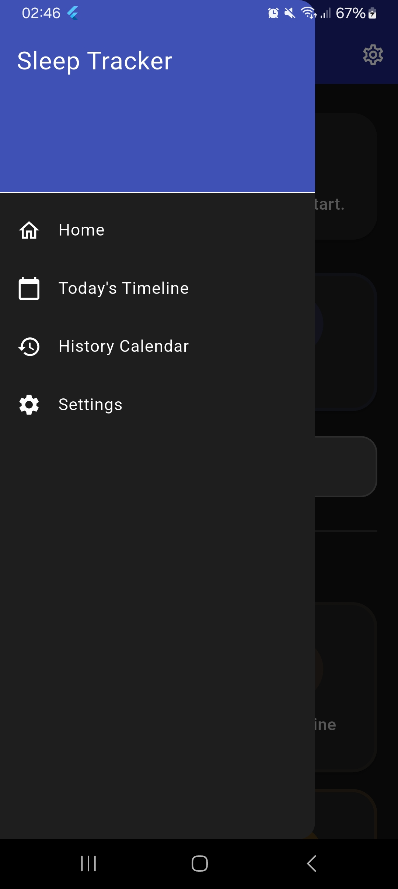
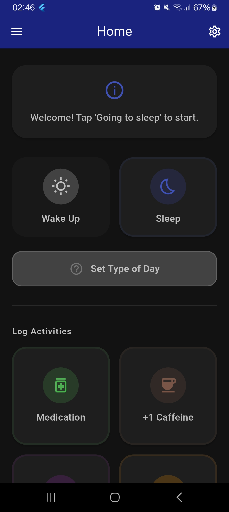
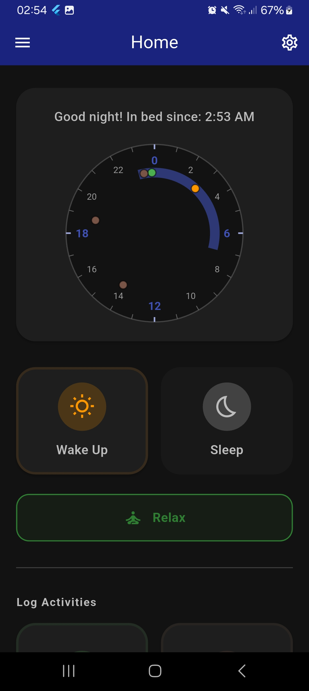
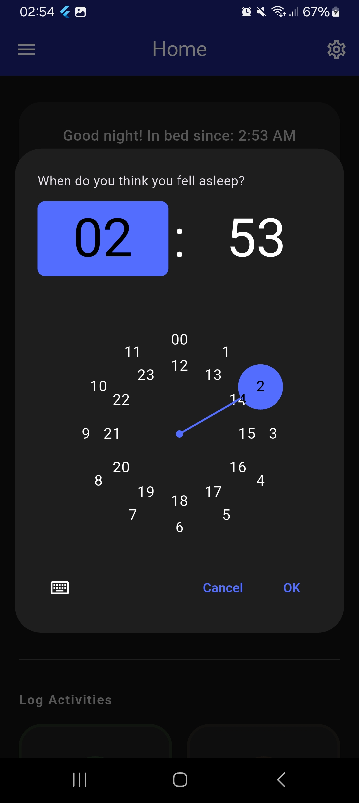
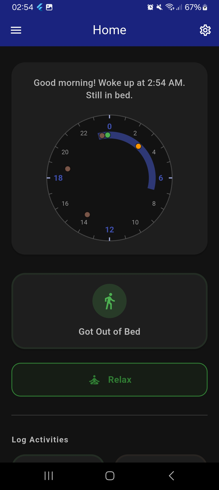
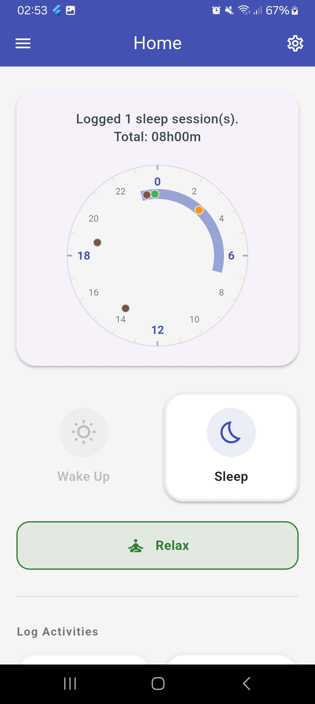

# User Interface

This document covers the main user interface aspects of the Impactive Sleep Tracker.

## Home Screen

The home screen is the main entry point of the app and provides an overview of the user's current sleep status and quick access to key features.

  
Full "Home" screen

  

    
  

### Layout and Components

- **App Bar**: Displays "Home" as the title with a settings icon in the top-right corner for quick access to settings.
- **Navigation Drawer**: Accessible by swiping from the left edge or tapping the drawer menu icon. Contains links to:
  - Home
  - Today's Timeline ([Events page](/documentation/features/3_events.md) for current day)
  - [History Calendar](/documentation/features/2_sleep_tracking_and_editing.md#editing-past-entries)
  - [Settings](#settings-screen)
  

    
"Navigation Menu" screen

    

      
    

  

- **Status Card**: Shows the current sleep status message (e.g., "Welcome! Tap 'Going to sleep' to start." or sleep duration summary). Includes a visual sleep clock when sleep data is available, displaying past sleep sessions as arcs and current sleep progress.
  - 

      
"Welcome" Status Card before sleep has been logged

      

        
      

    

  - 

      
Sleep clock visualization after sleep logging has started

      

        
      

    

  > [!TIP]
  > Click on the clock face visualisation to go to [today's events screen](/documentation/features/3_events.md)

- **Sleep Controls**: Two large buttons for [sleep management](/documentation/features/2_sleep_tracking_and_editing.md):
  - "Wake Up" and "Sleep" buttons when not in bed
    - 

        
"Sleep Controls" while asleep

        

          
        

      

    - 

        
"Fell Asleep Time" dialog (appears after waking up to note the actual time the user fell alseep)

        

          
        

      

  - "Got Out of Bed" button when awake in bed
    - 

        
"Sleep Controls" while awake in bed

        

          
        

      

- **Day Type Selector**: A customizable selector to categorize the type of day (e.g., Work Day, Rest Day). Tapping opens a dialog to select or add new day types, with an option to manage categories.

  > [!TIP]
  > Long-press on a selected day type to reset it.

- **Activities and Visualisations Grid**: A 2-column grid of buttons for various app functions:
  - Log Activities
    - Medication: Log medication intake
    - +1 Caffeine: Quick-add one cup of caffeine at the current time (long-press for full caffeine/alcohol screen)
    - +1 Alcohol: Quick-add one drink of alcohol at the current time (long-press for full caffeine/alcohol screen)
    - Exercise: Log physical activity
    - Notes: Add daily notes
  - Insights and Trends
    - Statistics: View sleep statistics
    - Sleep Graph: Visualize sleep patterns over time
    - Heatmap: View sleep data in calendar heatmap format
    - Circadian Drift: Analyze circadian rhythm shifts
    - Correlations: Explore relationships between sleep and activities
    - Efficiency: View sleep efficiency metrics
    - History: Access past entries calendar

  For more information on activities [click here](/documentation/features/3_events.md#daily-activity-logging).\
  For more information on visualisations [click here](/documentation/features/4_graphs_and_stats.md).

- **App Settings**: Additional button linking to the [settings page](#settings-screen).

## Navigation to Events Screen

The [Events screen](/documentation/features/3_events.md) allows detailed logging and editing of daily activities for a specific date.

### Accessing the Events Screen

- From the home screen navigation drawer: Tap "Today's Events" to view/edit events for the current day.
- The Events screen displays the selected date in the app bar and provides sections for:
  - Sleep Sessions: List of logged sleep periods with edit/delete options
  - Day Type: Selector for categorizing the day
  - Activity Buttons: Quick access to Medication, Caffeine & Alcohol, Exercise, and Notes screens

## Settings Screen

### Accessing the Settings Screen

- From the home screen app bar: Tap the settings icon (gear) in the top-right corner, or
- From the home screen: Scroll down and tap "App Settings", or
- From the navigation drawer: Tap "Settings".

### Settings Screen Contents

- **App version number**
- **Dark Mode Toggle**: Switch between light and dark themes.
  - 

      
"Home" screen (Dark mode)

      

        
      

    

  - 

      
"Home" screen (Light mode)

      

        
      

    

- **Notification Controls**: Turn the [notification service](/documentation/features/3_events.md#notification-service) on or off.
- **Manage Categories**: Button to access the [category management screen](/documentation/features/3_events.md#categories) for customizing day types, sleep locations, etc.
- **Export Data as CSV**: Button to [export all logged data](/documentation/features/5_data_management.md#data-export) as a CSV file for external analysis.
- **Import Data from CSV**: [Import past data](/documentation/features/5_data_management.md#data-import) from CSV files.
- **Clear All Saved Data**: Destructive action button to permanently delete all app log data (with confirmation dialog).
- **Visit GitHub Repo**: Link to source code.

  
"Settings" screen

  

    
  

