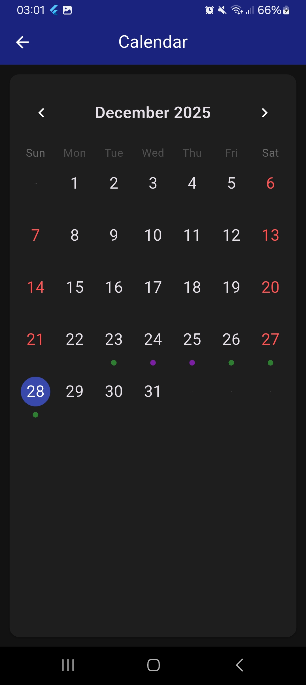

# Sleep Tracking and Editing

The sleep tracking feature allows users to record detailed sleep data, while the editing functionality enables modification of past entries for accuracy.

## Sleep Tracking

Users can log four key time points for each sleep session:

- **Bed Time**: The time the user gets into bed
- **Asleep Time**: The time the user falls asleep
- **Wake Time**: The time the user wakes up
- **Rise Time**: The time the user gets out of bed

Additionally, the user can add the **number of awakenings** and **estimated total time awake** for these. This is useful for a user who has many awakenings per night but does not keep track of exactly when they occur.

See user interface details [here](/documentation/features/1_user_interface.md#home-screen).

This detailed tracking helps calculate sleep duration, sleep efficiency, and identify patterns in sleep cycles.

## Editing Past Entries

The app provides a calendar view where users can:

- Select any past date to view sleep data
- Modify existing sleep and activity entries
- Add missing sleep data for previous days

When a day type has been selected, it appears as a colored dot below that day in the calendar view.

This leads to the [events page](/documentation/features/3_events.md) for the selected day.

  
"Calendar" screen

  

    
  

## Data Validation

The app includes validation to ensure logical time sequences (e.g. bed time before asleep time, wake time before rise time), preventing invalid data entry.
